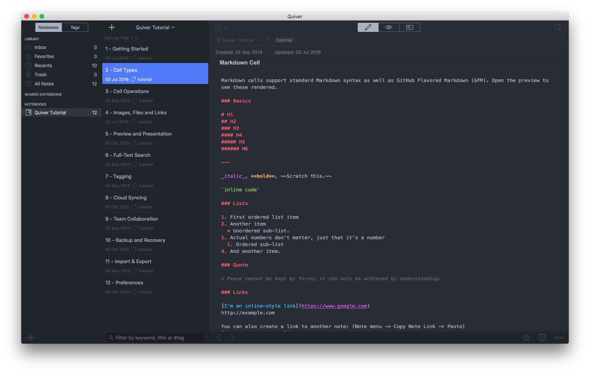

# Quiver Theme — One Dark

A Dark theme for [Quiver](https://itunes.apple.com/app/quiver-programmers-notebook/id866773894?ls=1&mt=12&at=11l5Lz) based on Atom's [One Dark UI](https://github.com/atom/one-dark-ui).

## Instalation

1. Either clone this repository or simply download the theme's [json file](https://raw.githubusercontent.com/pslobo/Quiver-Theme-Atom-One-Dark/master/Atom%20One%20Dark.json);
2. Then open settings, choose **Load Theme** and select the json file.

If you'd like to help, read the [documentation](https://github.com/HappenApps/Quiver/wiki/How-to-Design-a-Custom-Theme) on how to create a custom theme and then start hacking. I'm sure it'll be glaringly obvious, but CSS isn't my strong suite so there is much room for improvement.

## Syntax Highligthing
Quiver uses [Ace Editor](https://github.com/ajaxorg/ace) and therefore relies on existing themes for Syntax highligting. Unfortunately, none of the existing syntax themes look good with One Dark and therefore I've started working on porting the theme.

Want to help/hack/test the syntax theme? Easy!

1. Download or clone [Ace Editor](https://github.com/ajaxorg/ace);
2. Place `one-dark.css` and `one-dark.js` in `ace-master/lib/ace/theme`
3. Edit `ace-master/lib/ace/ext/themelist.js` and add `["One Dark"              ,"one_dark"                 ,  "dark"],` to `var themeData`
3. Open `kitchen-sink.html` in the root folder. Choose One Dark theme.
5. Now you can hack `one_dark.css` and see the results of your work.

## ⚠️ Experimental ⚠️

Syntax themes seem to be hardcoded into Quiver and until I've got a decent enough version that Yaogang Lian can include in Quiver, the only way to test/use this in Quiver is through and small hack.
So, if you like living on the edge and are dying to see this working in Quiver, then follow these steps.

While I'm not responsible if this breaks anything, I have been testing this already and as far as I can tell, no kittens have been harmed so far.

1. Open Finder, right click (ctrl+click) on Quiver and choose `Show Package Contents` from the context menu;
2. Place `theme-tomorrow_night_eighties.js` in `Contents/Resources/html-build/vendor/ace`and enter your password when requested;
3. Open quiver settings and choose `Tomorrow Night Eighties` theme for code cell.

## TODO

- [x] !!Create syntax highligting for Ace Editor so that we have code cell to match the theme.
- [] Improve syntax highligting in the editor view for LaTEX and diagram cell. Colors still seem a little off;
- [] Work on Preview, Presentation and Export themes;
